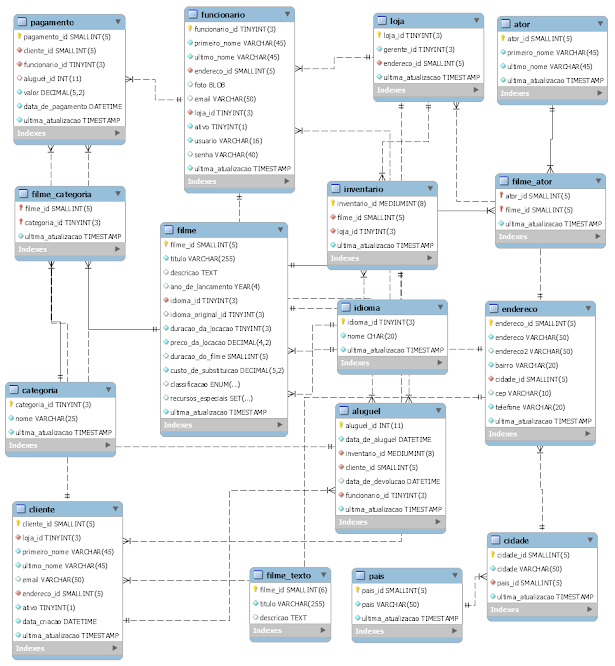

## 💻 Projeto
Lista de exercicios de banco de dados utilizando o banco SAKILA(Portugues) 
Banco Sakila exercicios Locadora / Sakila_db 🎲 

## 🔖 Para fazer os exercicios teve a utilizaçao dos seguintes metodos:
- SELECT
- INNER JOIN
- SUBCONSULTAS
- VIEW
- FUNCTIONS

## 📷 Imagem do diagrama utilizado a seguir...

Lista finalizada por Amadeu Filipe Lopes:wave: [Entre em contato!](https://www.linkedin.com/in/amadeu-filipe-lopes12/)
